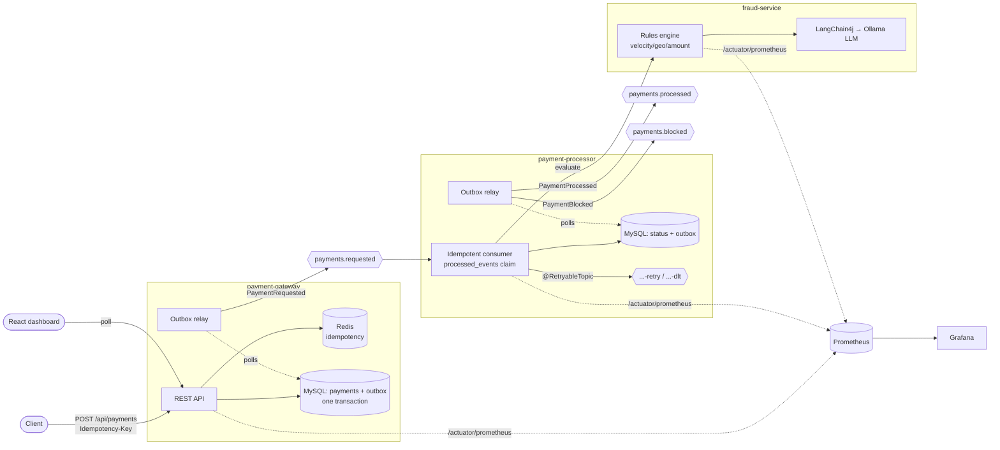

# TransactIQ

A distributed payment-processing system with event streaming, idempotent processing, an
LLM-based fraud triage layer, and full observability.

> **Status:** Phases 0–6 complete. End-to-end payment flow with idempotent, effectively-once
> processing, LLM fraud triage, observability, a React dashboard, and Docker/Helm packaging.

## Architecture



**Guarantee:** *effectively-once* — idempotent processing over Kafka's at-least-once delivery.
See [Correctness model](#correctness-model-the-part-interviewers-probe) and
[Fraud triage](#fraud-triage-phase-3) for the honest *not-exactly-once* and *why-an-LLM*
rationale.

## Tech stack (locked)

| Concern              | Choice                                              |
|----------------------|-----------------------------------------------------|
| Language / framework | Java 21, Spring Boot 3.x                            |
| Build                | Gradle (Kotlin DSL), multi-module                   |
| Messaging            | Apache Kafka (KRaft, no Zookeeper), Spring Kafka    |
| Datastore            | MySQL 8 (business data + outbox + processed-events) |
| Cache / dedup        | Redis                                               |
| LLM                  | LangChain4j + Ollama (local, swappable) — Phase 3   |
| Frontend             | React (Vite) — Phase 5                              |
| Observability        | Micrometer + Actuator → Prometheus → Grafana        |
| Local orchestration  | docker-compose                                      |
| Prod orchestration   | Kubernetes (Minikube) + Helm — Phase 6              |

## Repo layout

```
services/
  payment-gateway/      REST edge — idempotency, outbox, publish (Phases 1–2)
  payment-processor/    idempotent Kafka consumer + retry/DLQ (Phases 1–3)
  fraud-service/        LangChain4j AI triage (Phase 3)
dashboard/              React (Vite) UI (Phase 5)
ops/
  prometheus/           scrape config
  grafana/provisioning/ datasource + dashboards
docker-compose.yml      local infra: Kafka, MySQL, Redis, Prometheus, Grafana
```

## Phase 0 — run it

**1. Start infra** (Docker Desktop must be running):

```bash
docker compose up -d
docker compose ps          # all services should reach "healthy"
```

Services and ports: Kafka `9092`, MySQL `3307` (host) → `3306` (container), Redis `6379`,
Prometheus `9090`, Grafana `3000` (admin/admin).

> **Kafka healthcheck note:** the KafkaCLI path can vary by image tag. If Kafka shows
> `unhealthy`, first confirm the binary path with
> `docker exec transactiq-kafka ls /opt/kafka/bin` — it is far more likely a healthcheck
> path issue than a broken broker.

**2. Run the services** (each in its own terminal — they run on the host in Phase 0):

```bash
./gradlew :services:payment-gateway:bootRun      # http://localhost:8080
./gradlew :services:payment-processor:bootRun    # http://localhost:8081
./gradlew :services:fraud-service:bootRun        # http://localhost:8082
```

**3. Verify health & metrics:**

```bash
curl -s localhost:8080/actuator/health           # {"status":"UP"}
curl -s localhost:8081/actuator/health
curl -s localhost:8082/actuator/health
curl -s localhost:8080/actuator/prometheus | head # Micrometer metrics
```

Then open Grafana at http://localhost:3000 and confirm the **Prometheus** datasource is green.

## Submitting a payment (Phases 1–2)

```bash
# Idempotency-Key is REQUIRED. Re-sending the same key never double-charges.
curl -i -X POST localhost:8080/api/payments \
  -H 'Content-Type: application/json' \
  -H 'Idempotency-Key: demo-001' \
  -d '{"amount":49.99,"currency":"USD","customerId":"cust-1","cardLast4":"4242","country":"US","merchant":"Acme"}'
# -> 202 Accepted {"paymentId":"...","status":"RECEIVED"}, becomes PROCESSED asynchronously.

curl -s localhost:8080/api/payments        # list payments and their statuses
```

## Fraud triage (Phase 3)

`fraud-service` is a **triage/explanation layer, not the sole detector**. It combines:

1. **Deterministic rules** (the authoritative backbone, fully unit-tested) — velocity /
   card-testing, geo mismatch / impossible travel, and amount anomaly, computed from an
   in-memory per-customer activity window. These set a **severity floor**.
2. **An LLM** (LangChain4j → **Ollama** `llama3.2` by default, no API key) that produces the
   final `APPROVE | ESCALATE | BLOCK` call plus human-readable reasoning.

Safety guards make a small local model trustworthy: the LLM can **escalate** above the rules
but never approve away a rule-driven block (severity floor), and its decision must be
**consistent with the risk score** (guards against erratic over-blocking). If the model is
unreachable it falls back to the deterministic decision. Provider is swappable via
`transactiq.fraud.llm.*` (set `enabled=false` to run rules-only).

*Why an LLM for triage, not detection:* the rules catch the clear-cut fraud deterministically;
the LLM adds nuanced judgement on ambiguous cases and, importantly, produces reviewer-friendly
explanations — without being trusted as the sole gatekeeper.

```bash
scripts/pull-ollama-model.sh          # once, after `docker compose up` (pulls llama3.2, ~2GB)
./gradlew :services:fraud-service:bootRun

curl -s -X POST localhost:8082/api/fraud/evaluate -H 'Content-Type: application/json' \
  -d '{"paymentId":"p1","amount":30000,"currency":"USD","customerId":"c1","country":"US"}'
# -> {"decision":"BLOCK","riskScore":0.9,"reasons":[...]}
```

The processor calls fraud-service for every payment; `BLOCK`/`ESCALATE` route to
`payments.blocked` (terminal `BLOCKED`), `APPROVE` to `payments.processed` (`PROCESSED`).

## Kubernetes + Helm (Phase 6)

Dockerfiles for all three services (multi-stage, built from the repo root) and a self-contained
Helm chart in [`deploy/helm/transactiq`](deploy/helm/transactiq) that deploys the apps + infra
(Kafka KRaft, MySQL, Redis, Ollama) to a cluster. See the [chart README](deploy/helm/transactiq/README.md)
for the full Minikube walkthrough.

> **Verification status (honest):** the gateway image builds, and the chart passes
> `helm lint` + `helm template` (14 objects render). A live end-to-end Minikube deploy is
> documented but was not executed in this dev environment.

## Dashboard (Phase 5)

A React (Vite) UI in [`dashboard/`](dashboard/): a **submit-payment form**, a **live payments
table** (2s polling) showing status + fraud decision + risk + human-readable reasoning, and a
link to Grafana. The processor persists the triage result on the payment row (V3 migration) so
the UI can show *why* a payment was approved/blocked.

```bash
cd dashboard && npm install && npm run dev   # http://localhost:5173 (gateway must be running)
```

## Observability (Phase 4)

Micrometer → Prometheus → Grafana. Custom metrics on the processing path (on top of the
auto-exported JVM / HTTP / Kafka-client metrics):

- `transactiq_payments_accepted_total{result}` — created vs idempotent hit (gateway)
- `transactiq_gateway_create_seconds` / `transactiq_processing_seconds` — timers with
  percentile-histogram buckets (→ p99 via `histogram_quantile`)
- `transactiq_payments_processed_total{status}` — PROCESSED vs BLOCKED
- `transactiq_events_duplicate_total`, `transactiq_events_dlq_total`
- `kafka_consumer_fetch_manager_records_lag_max` — consumer lag (auto)

A **provisioned Grafana dashboard** ("TransactIQ — Overview") charts throughput, p50/p99
processing latency, gateway p99, HTTP error rate, consumer lag, and fraud outcomes. Generate
load and watch it populate:

```bash
# with all services running:
for i in $(seq 1 60); do curl -s -o /dev/null -X POST localhost:8080/api/payments \
  -H 'Content-Type: application/json' -H "Idempotency-Key: load-$i" \
  -d '{"amount":42.00,"currency":"USD","customerId":"c1","country":"US"}'; done
```
Open Grafana → http://localhost:3000 (admin/admin) → **TransactIQ — Overview**.

> Note: with the LLM enabled, fraud triage (Ollama on CPU) is the throughput bottleneck — a
> good talking point. Set `FRAUD_LLM_ENABLED=false` for a rules-only, high-throughput run.

## Correctness model (the part interviewers probe)

End-to-end guarantee: **effectively-once** — idempotent processing over Kafka's at-least-once
delivery. We deliberately do **not** claim exactly-once (unachievable across a DB and a broker).

- **Idempotency at the edge** — `Idempotency-Key` header → Redis `SETNX` fast-path (hot dedup);
  the **UNIQUE constraint on `payments.idempotency_key`** is the durable source of truth. Same
  key → same payment id, never a second charge.
- **Transactional outbox** — the payment row and an `outbox` row are written in ONE DB
  transaction (no dual-write). A `@Scheduled` relay publishes unpublished rows to Kafka with
  `SKIP LOCKED`, stamping `published_at` only on broker ack. Both gateway and processor use it.
- **Idempotent consumer** — the processor claims each `event_id` in `processed_events`
  (PRIMARY KEY) in the SAME transaction as the business effect, so a re-delivered event is
  detected and skipped.
- **Retry + DLQ** — `@RetryableTopic` gives non-blocking retries
  (`payments.requested-retry-0/1/2`); poison messages land in `payments.requested-dlt`.

## Tests

Integration tests exercise the real Kafka + idempotency paths and **require the compose infra
to be running** (`docker compose up -d`). They use an in-JVM EmbeddedKafka broker + the compose
MySQL/Redis. (Testcontainers would be more hermetic, but this machine's Docker Desktop 29 drops
JDBC connections to Testcontainers' ephemeral ports — see `ReplayIdempotencyIT` Javadoc.)

```bash
./gradlew test                 # unit + integration tests (IdempotencyIT, ReplayIdempotencyIT)

# Soak test: fire N payments, SIGKILL the processor mid-run, restart, assert no loss / no dupes.
# Requires the gateway running on :8080.
./gradlew :services:payment-gateway:bootRun &   # in one terminal
scripts/soak-test.sh 200                         # in another
```

- `ReplayIdempotencyIT` — the same event delivered 3× produces exactly one business effect.
- `IdempotencyIT` — the same Idempotency-Key posted twice returns one payment / one outbox row.
- `soak-test.sh` — crash-recovery: **zero loss, zero duplicates** across a processor SIGKILL.

## Phased build plan

- **Phase 0** — scaffold + infra ✅
- **Phase 1** — happy-path payment flow ✅
- **Phase 2** — idempotency, transactional outbox, DLQ + retry ✅
- **Phase 3** — LLM fraud triage (LangChain4j + Ollama) ✅
- **Phase 4** — observability dashboards ✅
- **Phase 5** — React dashboard ✅
- **Phase 6** — Kubernetes + Helm (Minikube) ✅ *(Dockerfiles + Helm chart built & validated)*
- **Phase 7** — docs + architecture diagram ✅
